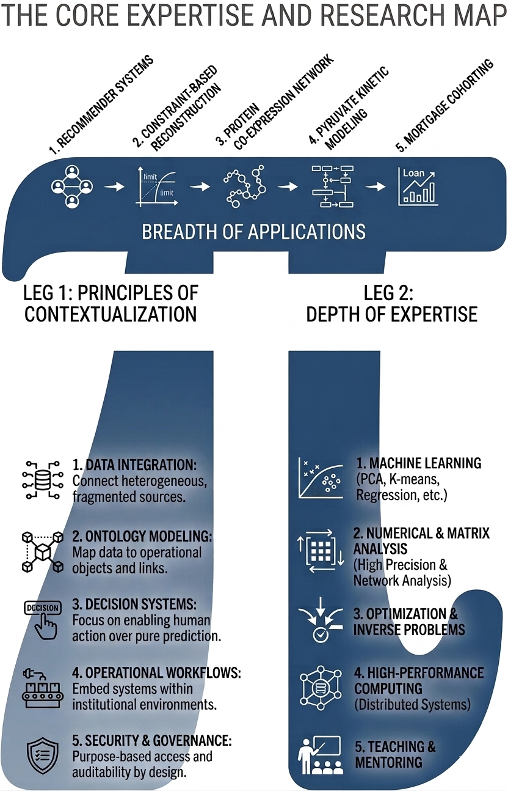
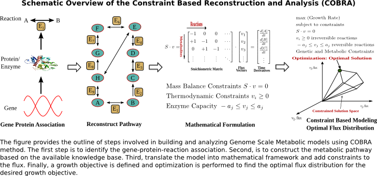
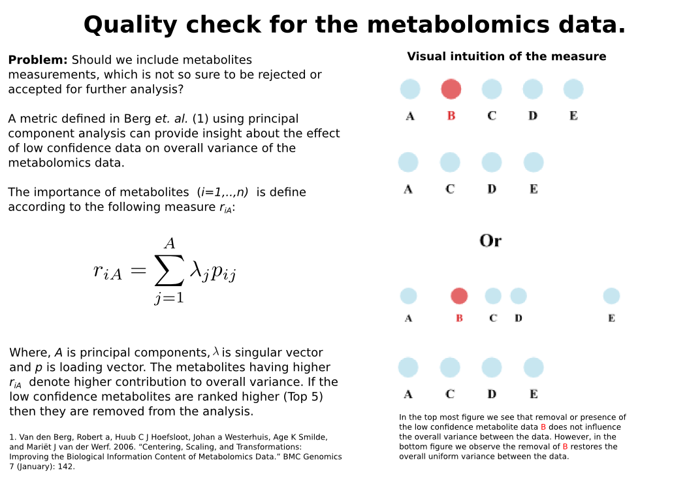
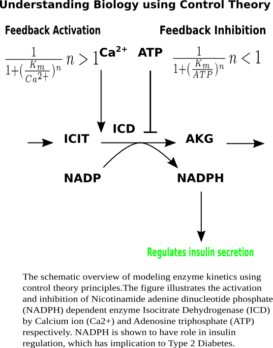
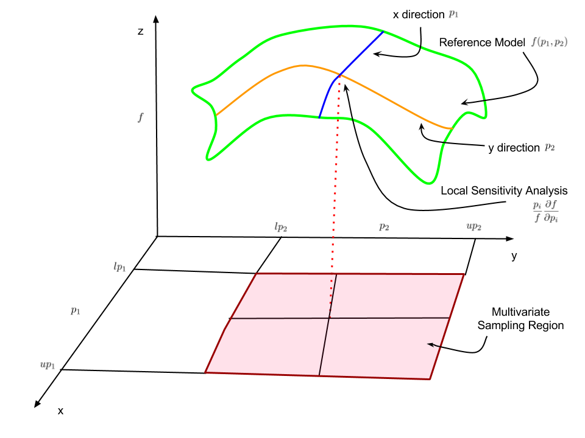

My academic research centers on developing analytical models to understand and predict complex systems. The methodological thread across this work is the use of *inverse problems*, *non-smooth optimization*, *network analysis*, and *computational science* to determine which variables matter, how they interact, and how uncertainty should shape decisions. Earlier projects examined *co-expression networks* and interaction *intracellular pathways* in type 2 diabetes and cancer cells. The current work using same methods extends the same questions to quantitative finance, where *new information* must be evaluated within *structured portfolio processes* rather than in isolation.

A full [research statement](research-statement.qmd) is available here.

## Research Areas

::: column-margin
{#fig-skill}
:::

### Quantitative Portfolio Research and Signal Additivity Evaluation

Systematic investing increasingly depends on deciding whether new information changes decisions after interactions, constraints, and estimation uncertainty are taken seriously. I study this problem by treating the portfolio process as a sequential decision system rather than as a collection of isolated backtests. The aim is to determine when a candidate signal contributes durable information, when it merely duplicates existing exposures, and when its apparent value is an artifact of a particular evaluation window or implementation choice.

This research area combines uncertainty quantification, global sensitivity analysis, and scalable computing. Variance-based methods such as Sobol and eFAST make it possible to decompose both marginal and interaction effects across realistic market scenarios, while high-performance Python workflows allow large experiment sets to be executed reproducibly. The broader objective is to build evaluation frameworks that are rigorous enough for academic study and operational enough for portfolio practice.

#### Graduate Thesis Topic: Uncertainty-Aware Signal Additivity in Quantitative Portfolio Research

One suitable graduate thesis in this area would investigate how the value of a candidate signal changes once portfolio constraints, estimation error, and cross-signal interactions are incorporated into the decision process. Rather than treating forecasting variables as stand-alone predictors, the thesis would frame signal evaluation as an inverse problem embedded within portfolio construction. The central research question would be whether a proposed source of information contributes robust decision value after accounting for the structural dependencies that arise in realistic allocation pipelines.

Methodologically, the thesis could combine portfolio optimization, uncertainty quantification, and global sensitivity analysis to separate marginal effects from higher-order interactions across alternative market regimes and implementation assumptions. A strong project design would include replication of an existing empirical result, systematic stress testing under revised evaluation protocols, and a transparent computational workflow that documents how conclusions change under different modeling choices. The scholarly contribution would be a defensible framework for determining when an apparent predictive improvement reflects genuine incremental information and when it is primarily an artifact of specification, sampling, or portfolio architecture.

# Publications

## Journal Publications

-   **Rahul Rahul**, Adam R. Stinchcombe, Jamie W. Joseph, Brian Ingalls (2023). Kinetic modelling of β-cell metabolism reveals control points in the insulin-regulating pyruvate cycling pathways. *IET systems biology*, *17*, 303-315.

-   Kavita Singh, Awantika Joshi, Nikhil, Srinivasapura Venkateshmurthy, **Rahul Rahul**, Mark D Huffman, Nikhil Tandon, Dorairaj Prabhakaran (2023). A Delphi Study to Prioritize Evidence-Based Strategies for Cardiovascular Disease Care in India. *Global Implementation Research and Applications 2023 3:3*, *3*, 272-283.

-   Parimal Samir, Christopher M. Browne, **Rahul**, Ming Sun, Bingxin Shen, Wen Li, Joachim Frank, Andrew J. Link (2018). Identification of Changing Ribosome Protein Compositions using Mass Spectrometry. *PROTEOMICS*, *18*, 1800217.

-   Parimal Samir, **Rahul**, James C. Slaughter, Andrew J. Link (2015). Environmental Interactions and Epistasis Are Revealed in the Proteomic Responses to Complex Stimuli. *PLoS ONE*, *10*(8), e0134099.

## Teaching

-   **Rahul** (2012). A Survey of Wiki Based Collaborative Learning Environments for the Interdisciplinary Training of the Students in Maths and Biology. \[Poster presentation\]. Opportunities and New Directions Conference, Centre of Teaching Excellence, University of Waterloo, Waterloo, Canada

## Presentations

-   Parimal Samir, **Rahul**, Andrew Link (2015). Quantitative proteomic analysis reveals environmental interaction and epistasis in the responses to complex stimuli in Saccharomyces cerevisiae. \[Paper presentation\]. 63rd ASMS Conference on Mass Spectrometry and Allied Topics, St. Louis, Missouri, USA
-   **Rahul**, Adam Stinchcombe, Jamie Joseph, Brian Ingalls (2012). Kinetic Modelling of Pyruvate Recycling Pathways in Pancreatic $\beta$-Cells. \[Paper presentation\]. The 8$^{\text{th}}$ International Conference on Differential Equations and Dynamical Systems, Waterloo, Canada
-   **Rahul**, Adam Stinchcombe, Jamie Joseph, Brian Ingalls (2011). Dynamic Modelling of Metabolism in Pancreatic $\beta$-Cells. \[Paper presentation\]. The International Conference on Applied Mathematics, Modelling and Computational Science (AMMCS), Waterloo, Canada

## Posters

-   **Rahul**, Fanny Dupuy, Sébastien Tabariès, Nicholas Bertos, Daina Z. Avizonis, Morag Park, Peter Siegel, Uri D. Akavia (2014). A computational method to integrate gene expression and metabolomics data to identify metabolic adaptations in cancer. \[Poster presentation\]. Mechanisms Models of Cancer Conference, Cold Spring Harbor, USA
-   **Rahul**, Brian Ingalls (2013). Optimal parameter estimation of kinetic models using the surrogate-modelling framework. \[Poster presentation\]. RECOMB/ISCB Conference, Toronto, Canada
-   **Rahul**, Adam Stinchcombe, Jamie Joseph, Brian Ingalls (2012). Dynamic Modelling of Pyruvate Recycling Pathways in Pancreatic $\beta$-cells. \[Poster presentation\]. 13$^{\text{th}}$ International Conference on System Biology, Toronto, Toronto, Canada
-   **Rahul**, Adam Stinchcombe, Jamie Joseph, Brian Ingalls (2011). Dynamic Modelling of Metabolism in Pancreatic $\beta$-Cells. \[Poster presentation\]. Graduate Student Conference, Waterloo, Canada
-   **Rahul**, Adam Stinchcombe, Jamie Joseph, Brian Ingalls (2009). Dynamic Modelling of Metabolism in Pancreatic $\beta$-Cells. \[Poster presentation\]. Chemical Biophysics Symposium, Toronto, Canada

# Previous Research

## Co-Expression Network Reconstruction

While working as a sessional instructor, I did a collaborative research on the construction of the co-expression network for the undetermined system. We constructed the model using SPACE method. Next, we validated the model by matching the network with BioGrid database and corroborating the network against the power law structure. Next, we identified the hub proteins using the degree centrality measure, for example RHR2, RPL5 proteins were ranked highest. The entire work is now published and readers can check Parimal *et. al.* [@samir2015] and the source codes are available on [Sparse Correlation](https://bitbucket.org/r2rahul/sparsecorrelation) (accessed March 7, 2025).

## Post-Doctoral Research Work

::: column-margin
The iMAT algorithm restricts the reaction fluxes according to the expression profile of genes, that is enzymes corresponding to high expressed genes will carry more flux compared to low expressed genes
:::

In postdoctoral work, I developed the rigorous procedure for data aggregation (The figure illustrate one example of data quality check.) and built a model based on the constraint-based reconstruction and analysis (COBRA) method. The figure @fig-cobra provides the overview of the steps involved in the construction of a model through COBRA method.

{#fig-cobra}

There is growing evidence that the cancer cells metabolism is reprogrammed in many different ways compared to the healthy cell to meet the metabolic needs of cancerous cells. The constraint-based reconstruction and analysis (COBRA) methods integrate the biochemical, genetic, and metabolic knowledge into a mathematical framework that enables the systematic study of the metabolic phenotype of the cells

The crucial step in studying the cancer metabolism through COBRA methods is to obtain a generic GSM model, which can be fine-tuned to integrate gene expression and metabolomics data pertinent to cancer cells. We used modelBorgifier to integrate the three generic mouse Genome-scale model (GSM) into one aggregated mouse GSM model. Next, we computationally integrate the cancer cell-specific gene expression and metabolomics data into the model through iMAT algorithm. The figure @fig-metaquality provides the overview of methodology used to maintain data quality and integrate diverse data sets into COBRA analysis.

{#fig-metaquality}

After, constraining the GSM model to tissue-specific expression and metabolomics data, we performed computer simulations to compare simulated model results with the NCI 60 cell lines such that the model reproduces the common metabolic dysregulation found across the cancer cell lines. Next, we performed the flux variability analysis, which showed interesting result about increased activity of Lactate Dehydrogenase enzyme. The computer simulation showed that the Pyruvate Dehydrogenase, which is the entry point for TCA cycle from glycolysis cannot carry all the flux from increased activity of glycolytic enzymes, which leads to flux redirecting towards pyruvate dehydrogenase.

## Doctoral Research Work

::: column-margin
{#fig-pc}
:::

In my doctoral research work, I developed a model for the pyruvate recycling metabolic pathways to identify key regulatory components in the pathway, which influence pyruvate recycling and NADPH. Both, pyruvate recycling and NADPH has been shown to play a critical role in the insulin secretion. The malfunction of the key metabolic pathways such as pyruvate recycling pathway is shown to be correlated with the onset of Type 2 diabetes. Therefore, a better understanding of this pathway can suggest better targets for performing experiments and therapeutic intervention (@fig-pc).

The model, which I developed for the pyruvate recycling pathways, describes the TCA cycle, the pyruvate/malate shuttle, the pyruvate/citrate shuttle, and the pyruvate/isocitrate shuttle. The model consists of 24 states, 31 reaction fluxes, and 129 parameters. The majority of the parameters are pulled from literature, and a subset of 34 parameters was optimized to validate the model against the experimental data of Ronnebaum *et.al.* (@Ronnebaum2006). After testing the model against various results related to properties of pyruvate recycling pathways, I analyzed the model using global sensitivity analysis methods of Partial Rank Correlation Coefficient and Extended Fourier Amplitude Sensitivity Test and local sensitivity analysis (@fig-gsa). The objective of sensitivity analysis was to identify the important control points in the pyruvate recycling pathways. The model predicts that the dicarboxylate carrier (DIC) and pyruvate transporter (PYC) are the most important regulators of pyruvate recycling and NADPH production. Our analysis showed that variation in the pyruvate carboxylase (PC) flux was compensated for by a response in the activity of mitochondrial isocitrate dehydrogenase (ICDm) resulting in the minimal changes in overall pyruvate recycling flux. The model predictions suggest points for further experimental investigation, as well as potential drug targets for the treatment of type 2 diabetes.

::: column-margin
{#fig-gsa}
:::

## Master Research Projects

### High-Performance Computing based Monte Carlo Simulation Framework for Spatio-temporal Analysis of Protein Oscillations in *E. Coli*

Developed a **scalable and efficient simulation framework** for spatio-temporal Monte Carlo simulations to solve partial differential equations (PDEs) on **high-performance computing (HPC) infrastructure** provided by BioGrid India ([link](http://www.scfbio-iitd.res.in/biogrid/biogrid130307.htm)).

The project emphasized **automation, scalability, and reliability** throughout the entire simulation lifecycle, incorporating the following key principles:

-   Optimized Parallel Scheduling: Efficiently distributed computational tasks across HPC nodes to maximize resource utilization and accelerate simulation time.\
-   Monitoring, Traceability, and Reproducibility: Ensured all simulations were trackable and reproducible, enabling consistent and dependable outcomes.\
-   Checkpointing for Fault Tolerance: Implemented checkpointing mechanisms to resume simulations from the last successful state, significantly reducing computational overhead and preventing full restarts in case of interruptions.

### Optimizing Conducting Polymers for Next-Generation Solar Energy Harvesting

This project focused on the synthesis and characterization of **novel conducting polymers** for application in **solar cells**. We explored various polymerization techniques and doping strategies to optimize conductivity and bandgap alignment, enhancing light absorption and charge transport.

We successfully fabricated polymer-based solar cells and evaluated their power conversion efficiency and stability. The research demonstrated the potential of these cost-effective and flexible materials for efficient solar energy harvesting, contributing to the advancement of sustainable energy solutions.

## Summer Internship Project: Temperature and Pressure-Based Humidity Prediction with Carbon Hygristor Sensors

While working as a Summer Research Assistant at the Indian Meteorological Department, New Delhi, India, under the supervision of Dr. K. C. Saikrishnan, I developed a **multivariate linear regression model** to analyze **humidity sensor (Hygristor) data** under controlled laboratory conditions using *MATLAB Curve Fitting Toolbox*.

Using this regression model, we examined the impact of **temperature and pressure** on the sensor’s humidity readings. Our analysis revealed that:

-   At **low temperature and pressure**, the sensor readings were more influenced by **pressure**.\
-   At **high temperature and pressure**, **temperature** became the dominant factor.\
-   Under **standard room conditions**, the sensor readings remained **unaffected** by temperature or pressure.

This study provided valuable insights into the sensor's behavior under varying environmental conditions, contributing to improved calibration and accuracy in humidity measurement.