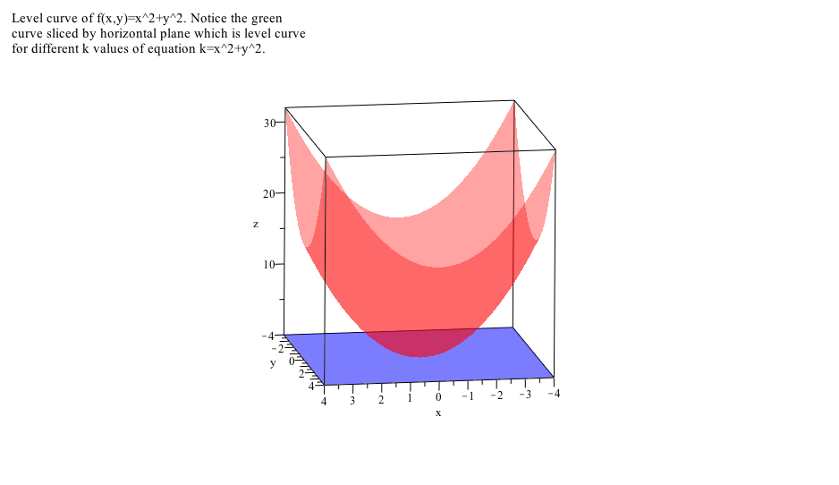
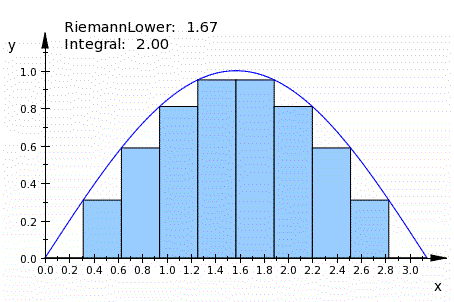

I have a keen interest in designing programs that integrate technology—such as **Clickers, Virtual Reality, and AI assistants**—to promote **active and experiential learning**. I hold a [Certificate in University Teaching](https://uwaterloo.ca/centre-for-teaching-excellence/) from the [University of Waterloo](https://uwaterloo.ca/).

My interest focus on designing **classroom activities** that foster resilience, empathy, and first principle problem solving thinking in students—critical skills for success in an ever-evolving workplace environment.

Please refer to my [Teaching Dossier](files/RahulTeachingDossier.pdf) for a comprehensive overview of my teaching philosophy and educational methods.

## Teaching Design Workflow

My teaching design follows the same principle as my professional work: begin by contextualizing the problem, identify the abstractions students need, and use technology only where it sharpens reasoning rather than replacing it.

```{mermaid}
flowchart LR
  A["Contextualize<br/>the problem"] --> B["Decompose into<br/>first principles"]
  B --> C["Choose representations<br/>and tools"]
  C --> D["Structured<br/>practice"]
  D --> E["Feedback and<br/>reflection"]
  E --> F["Transfer to<br/>unfamiliar problems"]
```

This workflow informs how I use clickers, visual demonstrations, and AI assistants in the classroom: the tools support contextualization, but the teaching objective remains durable problem solving and transfer.

Building on my industry experience and university teaching background, I aim to create a course on both core and elective topics like:

-   Core Courses: Linear Algebra, Calculus, Optimization, Machine Learning, Deep Learning, Natural Language Processing, Data Visualization.

-   Elective Courses or Bridge Courses:

    -   **Elements of Forward-Deployed Engineer**. This course will provide a structured framework for developing **innovative solutions** to real-world business challenges. [Course Outline](elements-of-forward-deployed-engineer.qmd)[^1]

    -   **Field Study in the History of Indian Mathematics**. This course uses structured library reading, informational interviews with experts and historians, and collaborative report writing to study mathematical developments associated with Nalanda University and the Gupta Empire. [Course Outline](field-study-history-of-indian-mathematics.qmd)[^2]

[^1]: This course outline was prepared with the help of GitHub Copilot.

[^2]: This course outline was prepared with the help of GitHub Copilot.

## Teaching Roles

### Visiting Lecturer

-   [BRIDGE School of Management, India](https://www.linkedin.com/company/india-education-services-pvt-ltd/) in collaboration with [Northwestern University, USA](https://www.northwestern.edu/):
    -   Course: Introduction to machine learning and advance modeling methods

### University Teaching

At the University of Waterloo, I worked as a teaching assistant and sessional lecturer. I taught following courses in the Department of Applied Mathematics at the University of Waterloo:

-   Calculus III for Honours Mathematics

-   Calculus I for Engineers

-   Calculus II for Sciences

Selected Courses where I worked as a Teaching Assistant:

-   Computational Cell Biology (Graduate Course)

-   Environmental Informatics (Graduate Course)

-   Calculus I, II, III for Engineers

-   Introduction to differential equations

-   Linear Algebra I

-   Calculus I, II, III for Honours Mathematics

### Teaching Research

-   **Rahul** (2012). A Survey of Wiki Based Collaborative Learning Environments for the Interdisciplinary Training of the Students in Maths and Biology. \[Poster presentation\]. [Opportunities and New Directions Conference, Centre of Teaching Excellence, University of Waterloo, Waterloo, Canada](https://1drv.ms/b/c/788d9c1f01ad6eef/EZF8GeeLBylMmYRfCKN3zMMBDDdc4xo41o4Z0oy4xPP02Q?e=tcsol9)
-   CTE Dissertation title: [Wiki as a Teaching Tool for the Systems Biology Class.](https://1drv.ms/b/c/788d9c1f01ad6eef/EROoYspmwghCshKavv8wpDIB9UZdFtCQwWU672ULknqUTw?e=JP5RtY)

### Teaching Demonstrations

Please find different visual presentations, which I developed in MUPAD (MATLAB’s symbolic interface.) on my Github repository: <https://github.com/r2rahul/teachingdemo>

Reference: Crouch, Catherine, Adam P. Fagen, J. Paul Callan, and Eric Mazur. “Classroom Demonstrations: Learning Tools or Entertainment?” American Journal of Physics 72, no. 6 (June 1, 2004): 835–38.

::: {layout-ncol="2"}



:::

Other Teaching Resources: [Teaching Demonstrations and Materials](https://1drv.ms/f/c/788d9c1f01ad6eef/ElnXQf4jhF1GsS7s-CuM9kIBGDlxdcosiftHqwBJtNYDIg?e=qo7f6n)

## Teaching Resources

#### Educational Tools

-   Tools that I frequently used while teaching:

    -   Interactive White Board Software Open Board (formerly Open Sankore:) <https://openboard.ch/download.en.html>

    -   Audience Response System, iClicker: <http://www1.iclicker.com/>

    -   Yed Graph editor tool used to build Concept Maps: <http://www.yworks.com/en/products_yed_about.html>

#### Massive Open Online Courses (MOOC):

-   EDUC115N How to Learn Math: <https://class.stanford.edu/courses/Education/EDUC115N/How_to_Learn_Math/about>

-   EDUC115-S How to Learn Math: For Students: <https://class.stanford.edu/courses/Education/EDUC115-S/Spring2014/about>

-   Effective Thinking Through Mathematics: <https://www.edx.org/course/utaustinx/utaustinx-ut-9-01x-effective-thinking-1178#.VCnfG_ldV-4>

-   Introduction to Mathematical Thinking: <https://www.coursera.org/course/maththink>

-   Learning How to Learn: <https://www.coursera.org/course/learning>

-   Teaching College-Level Science and Engineering: <http://ocw.mit.edu/courses/chemistry/5-95j-teaching-college-level-science-and-engineering-spring-2009/>

#### Articles and Books

-   Shors, Tracey J. “Saving New Brain Cells.” Scientific American 300, no. 3 (March 1, 2009): 46–54.

-   Polya, G. How to Solve It: A New Aspect of Mathematical Method. Princeton University Press, 2014.

-   Lockhart, Paul. A Mathematician’s Lament. Bellevue Literary Press, 2009.

-   Burger, Edward B., and Michael Starbird. The 5 Elements of Effective Thinking. Princeton University Press, 2012.

-   Dweck, Carol. Mindset: The New Psychology of Success. Random House Publishing Group, 2006.

-   Wilder, R. L. “The Role of Intuition.” Science 156, no. 3775 (May 5, 1967): 605–10.

-   Devlin, Keith J. Introduction to Mathematical Thinking. Keith Devlin, 2012.

-   Eric Mazur, “The Problem with Problems,” Optics & Photonics News 7(6), 59-60 (1996)

-   Norman, Marie K. How Learning Works: Seven Research-Based Principles for Smart Teaching. 1 edition. San Francisco, CA: Jossey-Bass, 2010.

-   Center for Teaching Excellence at the University of Waterloo has great resources for teaching with technology and other useful articles: <https://uwaterloo.ca/centre-for-teaching-excellence/resources/educational-technologies>